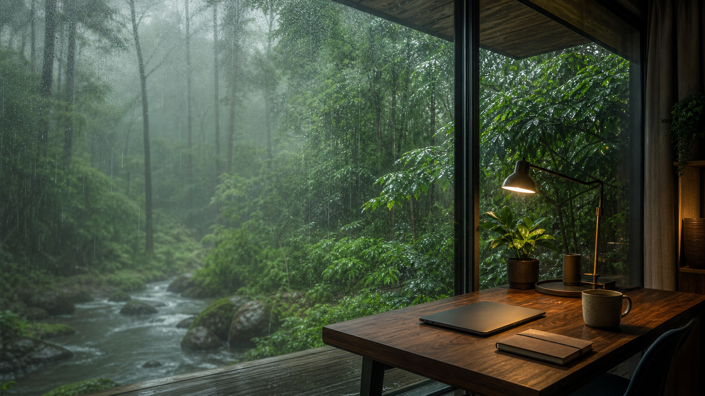

# Codex Skins

一个非官方 Codex Desktop 主题皮肤合集，主题包适配
[`Fei-Away/Codex-Dream-Skin`](https://github.com/Fei-Away/Codex-Dream-Skin)。

> 本仓库不是 OpenAI / Codex 官方项目。主题通过 Codex Dream Skin 的本地注入机制生效，不修改 Codex `.app`、`app.asar` 或应用签名。

## 已有主题

| 主题 | 风格 | 目录 |
| --- | --- | --- |
| 铁律训练场 | 高端商业力量区 / 健身房 | [`dream-skin/preset-iron-discipline`](./dream-skin/preset-iron-discipline/) |
| Apex Pit | 原创 GT 赛道维修区 | [`dream-skin/preset-apex-pit`](./dream-skin/preset-apex-pit/) |
| 雨林专注 | 雨中森林 / 写代码氛围 | [`dream-skin/preset-rainforest-focus`](./dream-skin/preset-rainforest-focus/) |
| 雪湖工作台 | 湖泊雪山 / 写代码氛围 | [`dream-skin/preset-alpine-lake-desk`](./dream-skin/preset-alpine-lake-desk/) |

## 预览





## 如何使用

主题需要配合上游项目 Codex Dream Skin 使用。推荐先安装 Codex Dream Skin，再把本仓库里的主题复制到它的主题库。

### Apex Motion 增强运行时

本仓库同时维护一个基于上游 macOS 版本的增强运行时，增加可配置的动态雨线、信号灯、遥测扫光，以及首页/已有对话分别优化的可读性规则。完整源码和上游许可证位于 `engine/macos/`。

首次安装需要先关闭 Codex：

```bash
./scripts/install-enhanced-runtime.sh
```

如果已经安装 Dream Skin，只想在当前会话更新增强资源，可以热更新后重新切换主题：

```bash
./scripts/install-enhanced-runtime.sh --hot
~/.codex/codex-dream-skin-studio/scripts/switch-theme-macos.sh \
  --id <theme-id>
```

热更新只修改 `~/.codex/codex-dream-skin-studio/assets/`，首次执行会保存 `.apex-original` 备份，不修改 Codex 应用程序或签名。

### 1. 安装 Codex Dream Skin

```bash
git clone https://github.com/Fei-Away/Codex-Dream-Skin.git
cd Codex-Dream-Skin/macos
./scripts/install-dream-skin-macos.sh
```

安装脚本会要求 Codex 处于关闭状态，因为它需要安全写入 Codex 配置并用本地 CDP 方式启动 Codex。CDP 是 Chrome DevTools Protocol，本质上是 Electron / Chromium 应用常用的本地调试通道。

### 2. 下载本仓库主题

```bash
git clone https://github.com/<your-name>/codex-skins.git
cd codex-skins
```

把 `<your-name>` 替换成实际 GitHub 用户名或组织名。

### 3. 命令行安装主题

```bash
./scripts/install-local-theme.sh preset-iron-discipline
~/.codex/codex-dream-skin-studio/scripts/switch-theme-macos.sh \
  --id preset-iron-discipline
```

如果切换时报 `Theme not found`，说明主题还没有复制到 Dream Skin 的主题库，重新执行 `install-local-theme.sh` 即可。

如果切换时报 CDP 或注入失败，通常是 Codex Dream Skin 还没有启动。可以运行：

```bash
~/.codex/codex-dream-skin-studio/scripts/start-dream-skin-macos.sh \
  --prompt-restart
```

### 4. 让 Codex 帮你安装

如果你已经在 Codex 里打开了这个仓库，也可以直接把下面这段提示词发给 Codex：

```text
请帮我安装这个仓库里的 Codex Dream Skin 主题。

要求：
1. 先检查我是否已经安装 Fei-Away/Codex-Dream-Skin。
2. 如果已经安装，把 dream-skin/preset-iron-discipline 复制到
   ~/Library/Application Support/CodexDreamSkinStudio/themes/。
3. 用上游 switch-theme-macos.sh 切换到 preset-iron-discipline。
4. 如果 Codex Dream Skin 没安装，先告诉我需要关闭 Codex 后再安装，不要直接强行关闭当前 Codex。
5. 安装后请验证 theme.json 和 background.jpg 是否存在，并说明是否真正完成切换。
```

更简短的版本：

```text
帮我把当前仓库里的 preset-iron-discipline 安装成 Codex Dream Skin 主题，并切换过去。注意不要在没确认的情况下关闭当前 Codex。
```

## 主题包结构

每个主题目录都遵循上游 `preset-*` 结构：

```text
preset-<slug>/
├── theme.json
├── background.jpg
├── preview.png
└── README.md
```

`background.jpg` 是真正被注入使用的纯背景图；`preview.png` 只用于 GitHub 和社媒展示。

## 制作新主题

做新主题时优先保证 Codex 信息可读性。好看的背景如果让文字、任务列表或输入框看不清，就不算合格主题。

核心规则：

- 背景必须是纯壁纸，不要包含 Codex 界面、按钮、文字、logo 或水印。
- 左侧 `x=0%..52%` 保持低信息、低对比，给 Codex 原生标题、项目列表和对话内容留空间。
- 主视觉尽量放在右侧 `x=62%..88%`，避免压住主要阅读区域。
- 如果背景整体偏深，`theme.json` 应使用浅色文字，例如 `text: "#f4f0e8"`。
- 如果背景整体偏浅，`theme.json` 应使用深色文字，例如 `text: "#202124"`。
- 不要出现“黑色字压在黑色背景上”或“白色字压在强白高光上”的组合。
- 强光、霓虹、复杂纹理和高对比器械细节不要放在输入框附近，尤其是画面下方中间区域。
- 每次生成背景后，都要在真实 Codex 或截图叠层里检查可读性。

更详细的制作约束见 [`docs/THEME_AUTHORING.md`](./docs/THEME_AUTHORING.md)。

## 分享建议

- 公开分享时说明这是非官方主题，不是 Codex 官方功能。
- 只发布自己原创、AI 生成且可分享、或明确授权的素材。
- 不要上传明星、网红、影视/游戏角色、商标 logo、带 UI 截图的背景图。
- 推荐每个主题都保留 `README.md`，写清楚风格、来源和使用方式。

## 许可

当前还没有选择正式开源许可。公开发布前建议先决定：

- 代码/脚本：MIT
- 主题图片：CC BY-NC 4.0 或 CC BY 4.0

如果只是先发仓库收集反馈，也可以暂时不加 license，但别人严格来说没有再分发授权。
