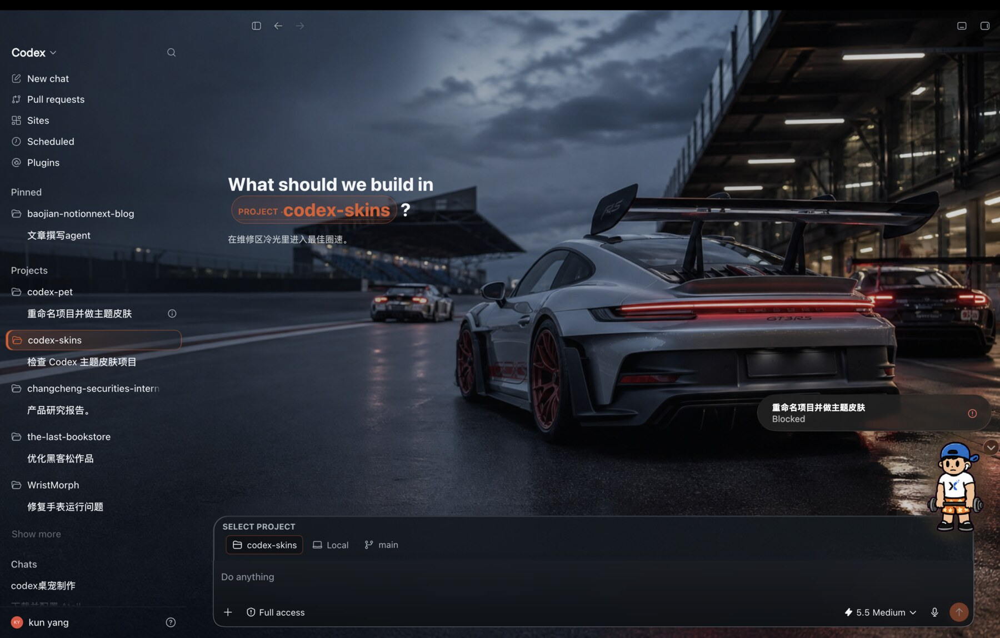

# Codex Theme Creator

**给不懂代码的用户使用的 Codex 主题管理器。**

它不是只换一张壁纸：你可以直接选择内置主题，也可以把一句想法或一张参考图交给 Codex，生成一套可以保存、微调、切换和分享的完整主题。

[打开产品官网](https://swording-k.github.io/codex-theme-creator/) · [下载 macOS Beta](https://github.com/swording-k/codex-theme-creator/releases/download/v0.1.1/Codex-Theme-Creator-0.1.1-arm64.dmg) · [提交问题或建议](https://github.com/swording-k/codex-theme-creator/issues/new?template=feedback.yml)

> Windows 主题运行时使用 Microsoft Store 版 Codex 的官方应用包启动接口。Windows 安装包仍需完成真实设备验证后才会作为稳定版公开发布。



## 宣传视频

<video src="https://swording-k.github.io/codex-theme-creator/assets/promo.mp4" controls width="100%" poster="https://swording-k.github.io/codex-theme-creator/assets/01-porsche-gt3rs.jpg"></video>

*36 秒看懂：怎么把一句想法变成一套能保存、微调、切换和分享的 Codex 主题。*

## 这个 App 能做什么

- 一键切换 GT 赛车、星空、训练场等内置主题；
- 在 App 里预览并调整背景模糊、压暗程度和强调色；
- 让 Codex 按统一格式创作新主题，完成后自动加入主题库；
- 导入、导出 `.ctheme` 主题包，发给朋友直接使用；
- 从菜单栏快速切换主题，或随时恢复 Codex 默认外观；
- 自动检查后续新版本。

## 普通用户怎么用

### 1. 下载

下载 [macOS Beta（Apple 芯片）](https://github.com/swording-k/codex-theme-creator/releases/download/v0.1.1/Codex-Theme-Creator-0.1.1-arm64.dmg)，打开安装包，把 `Codex Theme Creator.app` 拖进“应用程序”。

当前 Beta 已有开发者签名，但 Apple 最终验证仍在处理中。如果第一次打开出现“Apple 无法验证”：

1. 先点“完成”；
2. 打开“系统设置 → 隐私与安全性”；
3. 向下找到 Codex Theme Creator，点“仍要打开”。

这是 [Apple 官方提供的首次打开方式](https://support.apple.com/zh-cn/102445)。之后可以正常双击打开。

使用前请确认：

- 电脑是 Apple 芯片 Mac（M1/M2/M3/M4）；
- 已安装 Codex Desktop；
- Codex 外观建议设为深色，以获得更稳定的文字对比度。

### 2. 选择或微调主题

打开 App，选中一套主题。在右侧预览中调节背景模糊、压暗程度和强调色，然后点击“保存并应用到 Codex”。

需要回到原版时，点击“恢复 Codex 默认外观”。

### 3. 创作自己的主题

第一次启动 App 会自动安装随包附带的 **Codex Theme Creator 创作助手**，普通用户不需要下载 Skill，也不需要执行命令。

在 App 里点击“让 Codex 创作新主题”，把自动生成的提示发给 Codex，再加上自己的想法，例如：

```text
我想要一套 GT 赛车主题：雨后赛道、深色、红色强调色，文字必须清楚。
```

也可以附上一张参考图。Codex 会调用创作助手完成背景、配色、格式校验和安装；成功后，新主题会自动出现在 App 的主题库中。

### 4. 分享主题

点击“导出主题”会得到一个 `.ctheme` 文件。其他用户在 App 里点击“导入主题”，选中这个文件即可使用。

macOS 主题库位于：

```text
~/Library/Application Support/CodexDreamSkinStudio/themes/
```

## 它和固定主题包有什么不同

固定主题包只能使用作者提前做好的样式。Codex Theme Creator 同时提供：

- **主题管理器**：管理、微调、切换和分享；
- **主题创作助手**：把自然语言或参考图变成符合格式的主题包；
- **本地运行时**：把选中的主题应用到 Codex Desktop，不修改 Codex 的 `app.asar` 和应用签名。

每套主题本质上是一个本地主题包，核心内容是 `theme.json + 背景图`。用户自己的图片和创作内容都保存在本机。

## 给 Codex 或其他智能体

从源码接手前，请先阅读 [AGENTS.md](AGENTS.md) 和 [创作 Skill](skills/codex-theme-creator/SKILL.md)。当前公开产品的真实状态、测试命令和发布边界都写在 `AGENTS.md` 中。

用户从源码使用时，可以把下面这段话发给 Codex：

```text
请阅读并使用 https://github.com/swording-k/codex-theme-creator 。
按仓库里的 Codex Theme Creator Skill 为我创作一套完整主题；完成后写入本机主题库，并验证新聊天页和已有对话中的文字可读性。
```

开发启动：

```bash
git clone https://github.com/swording-k/codex-theme-creator.git
cd codex-theme-creator
./scripts/install-theme-creator.sh
./scripts/start-theme-app.sh
```

## 平台状态

| 平台 | 当前状态 |
| --- | --- |
| macOS Apple 芯片 | 公开 Beta：主题库、创作助手、微调、导入导出、菜单栏切换 |
| Windows | 支持 Microsoft Store 版 Codex 的主题库、主题包和本地注入运行时；在 ARM64 与 x64 实机完成安装、切换、恢复验证前仍标为测试版。 |

## 已知边界

Codex Desktop 更新后，界面结构可能变化。遇到不兼容时，请先在 App 中点击“恢复 Codex 默认外观”，再通过[反馈入口](https://github.com/swording-k/codex-theme-creator/issues/new?template=feedback.yml)告诉我们。

这是非官方社区项目，与 OpenAI 没有隶属或背书关系。macOS 主题运行时借鉴了 [Fei-Away/Codex-Dream-Skin](https://github.com/Fei-Away/Codex-Dream-Skin) 的本地注入思路。
