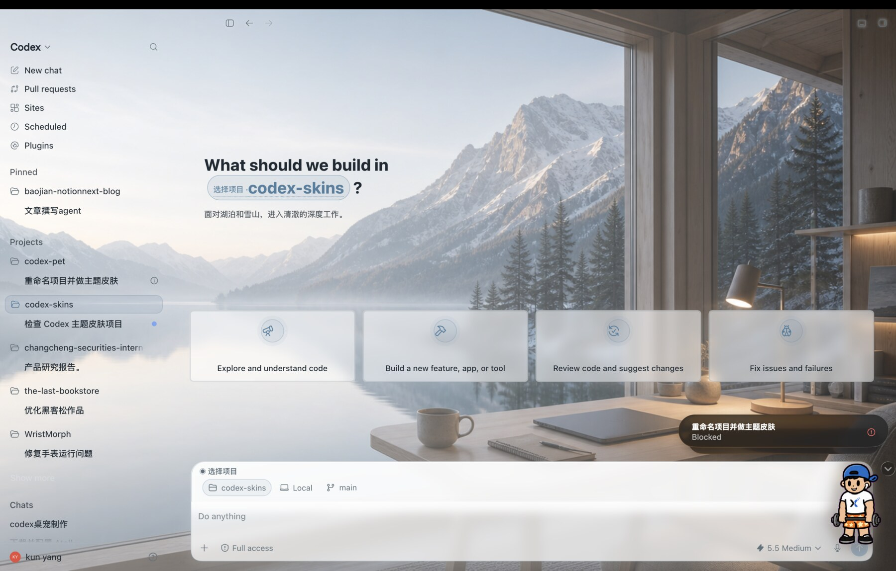
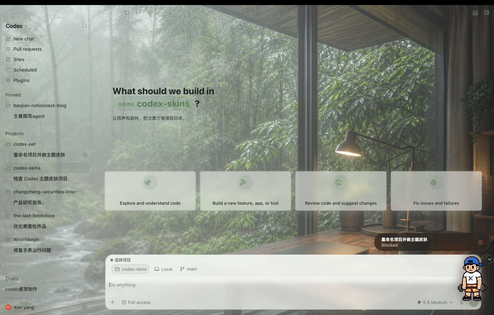

# Codex Theme Creator

通过一句话或一张参考图，让 Codex 为 macOS Codex Desktop 创作、安装并验证一套完整主题。

## 先看这里

这是一个给 **Codex Desktop 做主题** 的开源项目。它和普通皮肤包最大的区别是：

- 普通皮肤包：别人做好几套主题，你下载来用。
- Codex Theme Creator：你告诉 Codex 想要什么风格，Codex 帮你生成、安装、验证一套主题。

它不是网站，也不是在线服务。当前主要适合 macOS Codex Desktop 用户。

最简单的用法：

1. 把这个 GitHub 链接发给 Codex：`https://github.com/swording-k/codex-theme-creator`
2. 让 Codex 安装这个项目里的 Theme Creator。
3. 对 Codex 说：`帮我做一套宇宙主题，深色，玻璃质感，要保证文字清楚。`

你也可以直接复制这段给 Codex：

```text
请打开并安装这个开源项目：
https://github.com/swording-k/codex-theme-creator

安装后，帮我做一套完整的 Codex Desktop 主题。
我想要：宇宙、深色、玻璃质感、安静高级。
不要只换背景，侧栏、选中状态、输入框、按钮和已有任务页面也要统一。
完成后请切换主题，并验证真实 Codex 界面是否可读。
```

## 真实效果截图

### Porsche GT3 RS


### Alpine Lake Desk



### Rainforest Focus



以上截图来自真实运行中的 macOS Codex Desktop，不是背景图合成。

这不是单纯的壁纸替换器。生成结果可以统一改变：

- 左侧目录、项目与任务的普通/悬停/选中状态；
- New Chat 标题、项目入口和原生功能区域；
- 输入框、模型控制、权限控制、发送按钮；
- 已有任务的内容表面、代码区域和底部输入框；
- 经过限制的标题、状态条、边框和动态装饰；
- 首页与已有任务各自独立的透明度和可读性策略。

> 本项目是非官方开源实验，不由 OpenAI 制作或背书。运行时基于
> [`Fei-Away/Codex-Dream-Skin`](https://github.com/Fei-Away/Codex-Dream-Skin)
> 的 macOS 本地注入机制，不修改 Codex `.app`、`app.asar` 或应用签名。

简单说，`Codex-Dream-Skin` 是底层换肤运行时；本项目在它之上增加 Codex Skill、主题生成 schema、UI Profile、导出和真实界面验证流程。

## 它是怎样工作的

```text
文字想法 / 参考图
       ↓
Codex Theme Creator Skill
       ↓
背景资产 + 配色 + UI Profile + 装饰/动态配置
       ↓
Schema v2 Theme Compiler
       ↓
macOS 注入运行时
       ↓
真实 New Chat / 已有任务截图与兼容性检查
       ↓
安装主题或导出 GitHub 分享包
```

AI 负责理解审美、分析参考图和生成视觉资产；确定性脚本负责协议、路径安全、安装、恢复和验收。主题不能携带任意 JavaScript、远程资源或可点击覆盖层。

## 当前版本

首版支持 macOS Codex Desktop，并提供三种完整界面语言：

| UI Profile | 适合方向 | 主要感觉 |
| --- | --- | --- |
| `gt-control` | 赛车、工业、赛博、性能、游戏 | 深色控制台、强状态、紧凑信息 |
| `glass-studio` | 森林、雨、雪山、湖泊、编程、科技 | 半透明玻璃、安静、沉浸 |
| `editorial` | 人物、日系、浪漫、时尚、明亮主题 | 编辑感、柔和面板、叙事氛围 |

这是受控创作系统，不是允许 AI 随意注入 CSS/JS 的万能修改器。Codex Desktop 更新后，某些选择器可能变化；项目会用兼容性探针报告 `compatible`、`degraded` 或 `incompatible`。

## 别人到底怎么用

它当前不是网站，也不是在线 SaaS。最准确的形态是：

```text
一个 GitHub 开源仓库
+ 一个可安装的 Codex Skill
+ 一套 macOS 本地主题运行时
+ 若干可直接下载使用的主题包
```

普通用户有两种用法：

1. 只想用同款：从 `dream-skin/` 或 Release 下载预设主题，按说明安装。
2. 想自己创作：安装本仓库的 Skill，然后在 Codex 里用一句话或一张参考图让 Codex 生成、安装、验证、导出主题。

所以宣传时可以说：这是一个让 Codex 用户“用自然语言给 Codex Desktop 做完整主题”的开源工具，而不是只换壁纸的皮肤包。

## 宣传素材

可公开使用的预览图放在 [`media/promo`](media/promo/README.md)。每个主题目录都有：

- `preview.png`：适合 GitHub README、自媒体文章和视频封面；
- `background.jpg`：适合展示主题壁纸或做二次排版。

`private-themes/` 是本地私人主题目录，默认不会进入仓库，也不建议公开发布。

## 一键安装

在本仓库目录运行：

```bash
./scripts/install-theme-creator.sh
```

安装内容：

- Skill：`~/.codex/skills/codex-theme-creator/`
- Creator 引擎：`~/.codex/codex-theme-creator/`
- 已安装 Dream Skin 的增强运行时热更新

如果之前没有安装 Dream Skin，脚本只安装 Skill 和 Creator 引擎，不会强行关闭 Codex。等手头任务结束、主动关闭 Codex 后运行：

```bash
./scripts/install-enhanced-runtime.sh
```

已经安装 Dream Skin 时可以不重启 Codex：

```bash
./scripts/install-enhanced-runtime.sh --hot
```

## 让 Codex 帮你安装

把仓库交给 Codex 后发送：

```text
请安装当前仓库里的 Codex Theme Creator。

要求：
1. 先检查仓库和现有 Dream Skin 安装状态。
2. 运行 ./scripts/install-theme-creator.sh。
3. 不要擅自关闭或重启 Codex。
4. 验证 ~/.codex/skills/codex-theme-creator/SKILL.md 和 Creator 引擎是否存在。
5. 如果 Dream Skin 尚未安装，只告诉我需要在任务结束后关闭 Codex，再运行完整安装；不要现在强行操作。
6. 最后分别报告 Skill 已安装、运行时已安装、主题是否激活。
```

## 用一句话创作主题

安装后直接对 Codex 说：

```text
帮我做一套雨夜森林写代码主题。整体安静、深色、玻璃质感，
左侧目录和已有对话都要清楚。完成后安装，并分别验证 New Chat 和已有任务。
```

带参考图：

```text
参考我附上的图片，做一套完整的 Codex 主题。
不要只换背景：侧栏、选中状态、项目入口、输入框、按钮和已有任务内容都要统一。
保留参考图的色彩与氛围，不要把截图里的 UI 烧进背景。
完成后安装、截图验证，并导出可以分享的主题包。
```

GT 赛车示例：

```text
设计一套高级 GT 赛车控制台主题。背景要有真实赛道纵深，主车放在右侧；
侧栏用烟熏玻璃，当前项目用橙色状态条，输入框像赛事控制台。
不要启用廉价的白色雨线。安装后验证首页和当前任务。
```

Skill 会区分四种证据状态：

- `created`：主题文件已经生成并通过格式验证；
- `installed`：主题已经复制到本机主题库；
- `active`：真实运行时报告了目标主题 ID；
- `verified`：New Chat 和已有任务都经过真实截图与兼容性检查。

只有前两项不等于“主题已经在 Codex 里生效”。

## 手动创作流程

### 1. 创建主题工作目录

```bash
node skills/codex-theme-creator/scripts/prepare-theme.mjs \
  --name "Rainy Forest" \
  --idea "A calm rainy forest coding atmosphere with transparent glass surfaces" \
  --output-dir output/rainy-forest \
  --profile glass-studio \
  --reference /absolute/path/to/reference.png
```

`--reference` 可以重复；没有参考图时可以省略。生成背景后保存为工作目录中的 `background.png`。

### 2. 编译和校验

```bash
node engine/macos/scripts/compile-theme.mjs \
  --source output/rainy-forest/source-theme.json \
  --theme-dir output/rainy-forest \
  --output output/rainy-forest/theme.json

node engine/macos/scripts/injector.mjs \
  --check-payload \
  --theme-dir output/rainy-forest
```

### 3. 安装和切换

```bash
DEST="$HOME/Library/Application Support/CodexDreamSkinStudio/themes/theme-rainy-forest"
mkdir -p "$DEST"
cp output/rainy-forest/theme.json output/rainy-forest/background.png "$DEST/"

~/.codex/codex-dream-skin-studio/scripts/switch-theme-macos.sh \
  --id theme-rainy-forest
```

### 4. 验证真实界面

```bash
node engine/macos/scripts/compatibility-probe.mjs
```

探针会选择 Codex 主窗口而不是宠物 overlay，并按当前路由检查侧栏、输入框、项目入口或任务内容。

### 5. 导出分享包

```bash
node scripts/export-theme.mjs \
  --theme-dir output/rainy-forest \
  --output-dir release
```

导出器只打包允许的主题文件，自动移除来源记录中的本机绝对路径，并生成安装 README。发布前仍应人工检查 `preview-home.png` 和 `preview-task.png` 是否暴露私人项目名或聊天内容。

## 恢复原运行时

热更新首次执行时会为四个运行时文件保存 `.apex-original` 备份。恢复：

```bash
./scripts/restore-enhanced-runtime.sh
```

恢复后再切换一次主题以刷新当前窗口。完整停用 Dream Skin 使用其原始恢复脚本：

```bash
~/.codex/codex-dream-skin-studio/scripts/restore-dream-skin-macos.sh
```

## 主题包格式

```text
theme-<slug>/
├── theme.json
├── source-theme.json
├── background.png
├── provenance.json
├── preview-home.png
├── preview-task.png
└── README.md
```

运行时真正使用的是 `theme.json` 和背景图。预览必须来自真实 Codex，不得用 AI 绘制的整窗界面冒充实机效果。

## 内置主题

仓库仍保留早期主题包，可用于背景和配色示例：

| 主题 | 风格 | 目录 |
| --- | --- | --- |
| 铁律训练场 | 高端商业力量区 | [`dream-skin/preset-iron-discipline`](./dream-skin/preset-iron-discipline/) |
| Porsche GT3 RS | GT 赛车控制台 | [`dream-skin/preset-porsche-gt3rs`](./dream-skin/preset-porsche-gt3rs/) |
| 雨林专注 | 雨中森林、写代码 | [`dream-skin/preset-rainforest-focus`](./dream-skin/preset-rainforest-focus/) |
| 雪湖工作台 | 湖泊雪山、写代码 | [`dream-skin/preset-alpine-lake-desk`](./dream-skin/preset-alpine-lake-desk/) |

## 安全与隐私

- 不允许主题包包含任意 JavaScript、远程资源或可点击装饰层。
- 装饰层统一 `pointer-events: none`，不能挡住原生按钮。
- 不修改真实项目、任务、权限或账号信息。
- 默认不要公开带有私人项目名、聊天内容、账号信息的实机截图；只有本人确认可公开时才放入展示素材。
- 公开主题只使用原创、已授权或允许再分发的素材。
- 明星、动漫角色、汽车品牌等素材应先确认肖像权、版权和商标使用边界；私人使用不等于允许公开分发。

## 开发验证

```bash
engine/macos/tests/run-tests.sh
node skills/codex-theme-creator/tests/prepare-theme.test.mjs
```

测试覆盖 schema v2 编译、路径安全、UI 映射、三套完整 Profile、装饰点击安全、主题暂存、热升级、恢复、导出和路由兼容性判定。

## 许可

新增代码采用 [MIT License](./LICENSE)。`engine/macos/` 保留上游许可证和 NOTICE。仓库内公开原创主题素材采用 [CC BY 4.0](./ASSETS_LICENSE.md)，各主题另有说明时以主题目录为准。第三方品牌、人物、角色和用户参考图不自动获得再分发授权。
